## vue+express+nodejs移动端双语名著阅读

> 技术栈：vue + vue-router + vuex + webpack + fetch + less + flex + express + nodejs + localStorage

## 使用说明

#需要安装nodejs
```
#克隆项目
git clone https://github.com/chen406226/vue-bookread.git

# 安装依赖
npm install

#项目根目录执行

node app.js

# 本地开发环境 访问http://localhost:3000


F12调到你喜欢的移动设备观看

```

## 项目说明
该项目灵感来源于滴答双语阅读(一款双语名著阅读的app目前还可以下载)，但是这款软件已停止维护了，其功能太单调了只能阅读，所以根据其他网站整合了一个首页。

最初想用mongoose存储，可是没想好建模，就直接读取文件方式了，之后就没改。

用到了有道API希望可以自己申请在项目里替换，因为会被封的。

书是自己网上找到一段一段翻的，所以只有几章(因为太磨人了)，只有两本书可以点击（war and peace)和(the old man and sea）,其他的假书不要点击（只是凑整齐度的没有数据点击会报错的)

比起组织语言我感觉直接上图比较好 ←_←


## 项目截图
### 主页面觉得原app太单调加的有分类兴趣阅读只能点击老人与海/战争和平
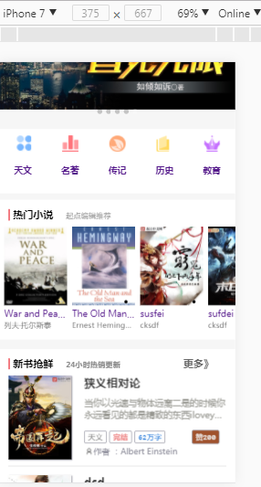
### 有你点击的书的详细信息，点击开始阅读，没做登录注册所以没有加入书架

### 需要控制的太多所以加了个home键作为控制菜单栏的道具←_←点击出来菜单
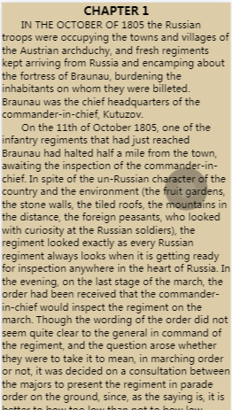
### 菜单有很多设置
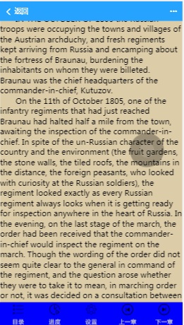
### 选择章节正序
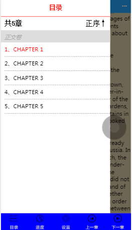
### 选择章节倒序
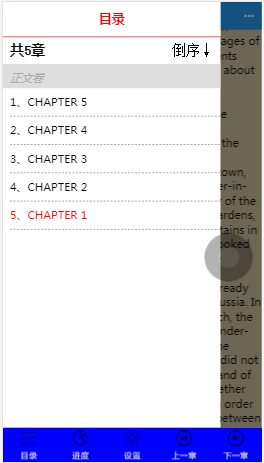
### 滚动百分比来查找章节
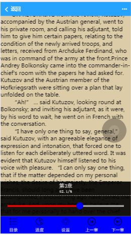
### 设置颜色和字体
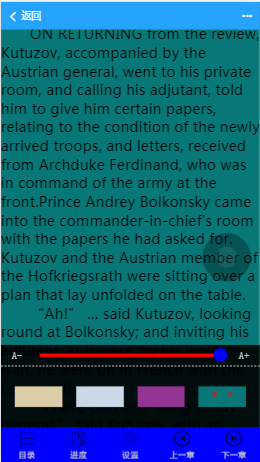
### 点击段落区域会出来翻译抽屉译文部分
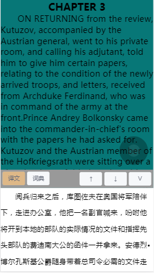
### 可以点击词典来查询生词哦 这时选中段落就会供给查询的单词
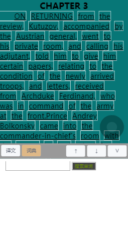
### 查询结果有动名词分析还有短句举例，当然必不可少的发音也是有的
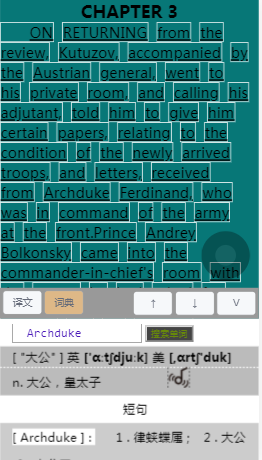
### 当然可以调节窗口的大小了，当你改变输入框中文字时，搜索按钮就可以点击了，当输入框中内容为空，或与当前查询相同时！点击是无效的
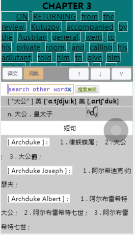
# 有很多瑕疵没有更正，界面也很丑。嗯！
#### 有喜欢的文章，名著想要分享的，可以做好数据格式（按照我那样做）。 小主QQ 451969599
